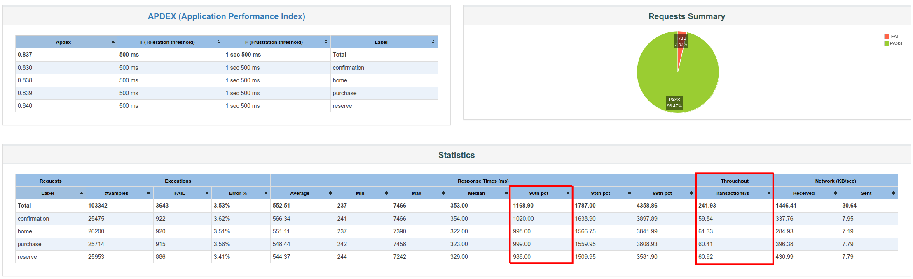
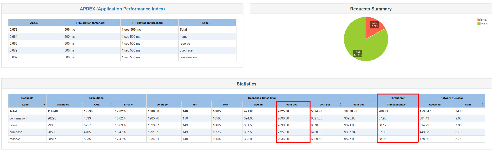
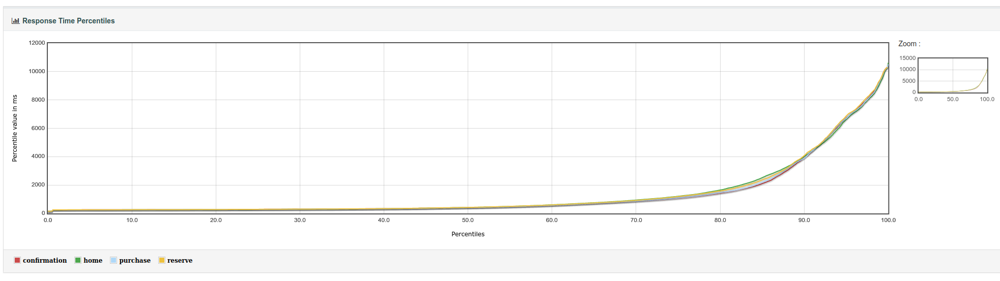

## :book: Desafio Teste de Performance

Desenvolva um script de performance para o seguinte cenário:
URL: https://www.blazedemo.com

Cenário:

- Compra de passagem aérea - Passagem comprada com sucesso.

Critério de Aceitação:

- 250 requisições por segundo com um tempo de resposta 90th percentil inferior a 2 segundos.

Instruções

- Escolha entre JMeter e Gatling
- Monte um teste de carga e um teste de pico que satisfaçam a vazão do critério de aceitação.
- Anexe o relatório da execução, e explique se o critério de aceitação foi satisfatório ou não, além dos motivos que te levaram a essa conclusão.
- Crie o repositório no GitHub (público) e COPIE E COLE o link aqui. Desenvolva a automação e suba o código no repositório (dica: crie primeiro o repositório, copie o link, cole neste campo e submeta o formulário).
- Não se esqueça do README.md, que deve conter
  - Instruções para a execução do script
  - Relatório de execução dos testes
  - Demais considerações pertinentes ao teste

---

## :microscope: Sobre os scripts

Os cenários foram escritos na ferramenta JMeter e foram divididos em dois scripts para facilitar a execução.

### Para a execução, basta:

1. Instalar o JMeter versão 5.4.1 ou superior: https://jmeter.apache.org/download_jmeter.cgi
1. Clonar o projeto ou baixar os scripts **carga.jmx** e **pico.jmx**
1. Executar o comando _**jmeter -n -t \<local do script> -l \<local do result> -e -o \<diretorio relatorio>**_
1. Por exemplo, no diretório onde estão os scripts rodar:
   > _jmeter -n -t carga.jmx -l carga_result.jtl -e -o carga_report_\
   > _jmeter -n -t pico.jmx -l pico_result.jtl -e -o pico_report_
1. Aguardar uns 7 minutos para a execução completa de cada script
1. Na pasta escolhida para gerar o relatório terá um arquivo **index.html** com o resultado da execução.

### Considerações dos scripts

Foi usado [um recurso do JMeter](https://jmeter.apache.org/api/org/apache/jmeter/timers/ConstantThroughputTimer.html) para manter a média de requisições por segundo dentro do critério de aceitação, com isso, algumas estratégias de think time adicionadas nas primeiras versões do projeto foram desabilitadas, pois com esse recurso o JMeter "atrasa" de forma proposital as requisições para manter dentro da média proposta, e os think time acabaram não surtindo efeito.

As requisições seguiram a ordem de acesso às páginas de compras:

1. home
1. purchase
1. reservation
1. confirmation

Para cada página foi adicionada asserções de **código de resposta (200)** e **tempo de resposta (2000ms)**. Com isso, algo fora desses parâmetros eram considerados como erro na requisição.

Foram usadas **1000 threads** e tempo de execução total de **7 minutos**.

A única diferença entre os scripts está no rampup\*:

- **carga.jmx**: 120 segundos de rampup
- **pico.jmx**: 0 segundo de rampup

\* Explico melhor esse ponto no relatório individual.

---

## :bar_chart: Relatório de execução

### Teste de Carga - :heavy_check_mark:

O teste de carga foi considerado satisfatório, pois atendeu os critérios de aceitação durante todo o período de execução mantendo uma taxa baixa de erros (menos de 4%):

Conforme observado, o tempo de resposta ficou em **1168.90ms** com um throughput de **241.93**\* transações por segundo. O que atende os requisitos.

\* O recurso do JMeter de manter um throughput não é preciso, pois trabalha na média, mas acredito que esse valor é aceitável dentro de um possível intervalo de confiança e também que aumentando o limite atenderíamos e até ultrapassaríamos as 250 requisições/segundo.

O relatório completo pode ser visto no html gerado em **./carga_report/index.html**.

### Teste de Pico - :heavy_multiplication_x:

Não ficou muito claro o que seria um teste de pico, então, foi entendido que seria um teste em que não há um rampup, ou seja, todas as requisições chegam de uma vez no início do teste. Logo foi dessa forma que foi configurado o script **pico.jmx**.

Para esse cenário o teste não foi considerado satisfatório, pois a latência aumentou acima do critério de aceitação e consequentemente a taxa de erros aumentou bastante (mais de 17%).

No gráfico de Response Time Percentiles fica mais claro que o critério não foi aceito:

Obs.: O recurso que limita o throughput do JMeter teve dificuldades para manter uma média, pois a aplicação estava respondendo de forma muito aleatória, dado a característica do teste.

O relatório completo pode ser visto no html gerado em **./pico_report/index.html**.
